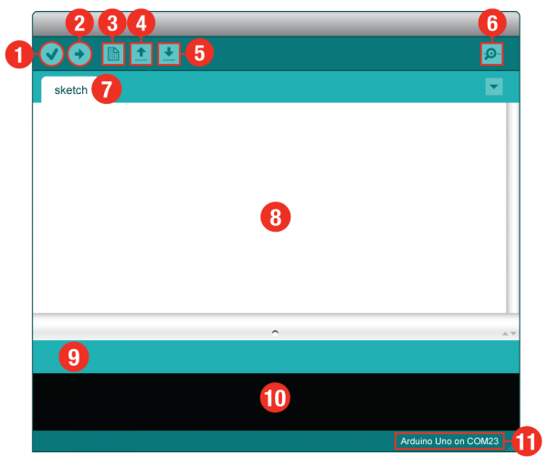

# Electricity

- Electricity is a circle
- Inputs and outputs
- Digital vs Analog

# Hardware

- boards
- wires
- inputs/sensors
- outputs/LEDs, motors

# Software

## Arduino IDE

- Download: https://www.arduino.cc/en/Main/Software

(image source: https://learn.sparkfun.com/tutorials/sik-experiment-guide-for-arduino---v32/all)

  1. Verify: Compiles and approves your code. It will catch errors in syntax (like missing semi-colons or parenthesis).
  1. Upload: Sends your code to the RedBoard. When you click it, you should see the lights on your board blink rapidly.
  1. New: This buttons opens up a new code window tab.
  1. Open: This button will let you open up an existing sketch.
  1. Save: This saves the currently active sketch.
  1. Serial Monitor: This will open a window that displays any serial information your RedBoard is transmitting. It is very useful for debugging.
  1. Sketch Name: This shows the name of the sketch you are currently working on.
  1. Code Area: This is the area where you compose the code for your sketch.
  1. Message Area: This is where the IDE tells you if there were any errors in your code.
  1. Text Console: The text console shows complete error messages. When debugging, the text console is very useful.
  1. Board and Serial Port: Shows you what board and the serial port selections

### After Install Steps

- For Windows computers:
  - Follow these steps to install the driver: http://slides.scholarslab.org/windows-arduino-setup/
- Select Board: https://learn.sparkfun.com/tutorials/sik-experiment-guide-for-arduino---v32/all#introduction-sik-arduino-uno
- Select Port

## Sketches
  - C/C++ programming language

### Loading Sparkfun SIK Code

- Download from https://www.sparkfun.com/sikcode

# Circuit Experiments

- A PDF version of the guide for creating the experiments is located here: https://cdn.sparkfun.com/assets/learn_tutorials/3/1/0/RedBoard_SIK_3.2.pdf

