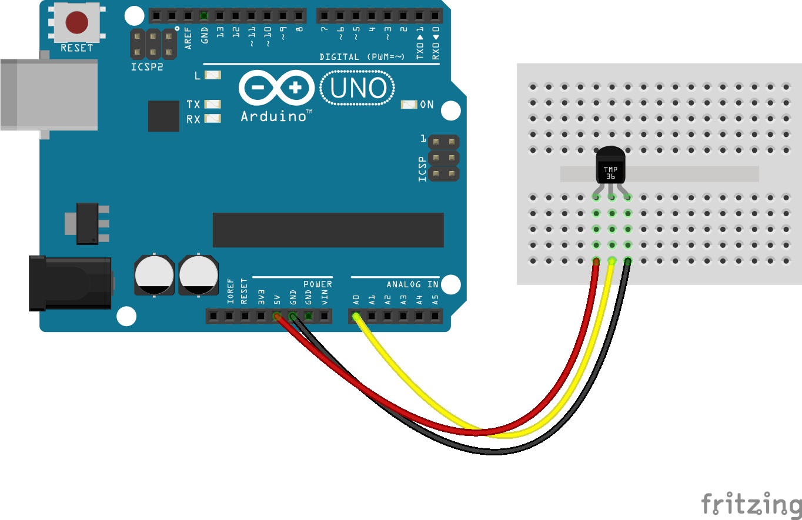

# Get the temperature

## Setup



(image source: https://github.com/rwaldron/johnny-five/blob/master/docs/temperature-tmp36.md)

## Code

```c
const int temPin = 0;

void setup() 
{
  Serial.begin(9600);
}

void loop() 
{
  float voltage, degF, degC;

  voltage = getVoltage(temPin);

  degC = (voltage - 0.5) * 100.0;
  degF = degC * (9.0/5.0) + 32.0;

  Serial.print("voltage: ");
  Serial.print(voltage);
  Serial.print(" C: ");
  Serial.print(degC);
  Serial.print(" F: ");
  Serial.println(degF);

  delay(1000);
}

float getVoltage(int pin)
{
  return (analogRead(pin) * 0.004882814);
}
```
