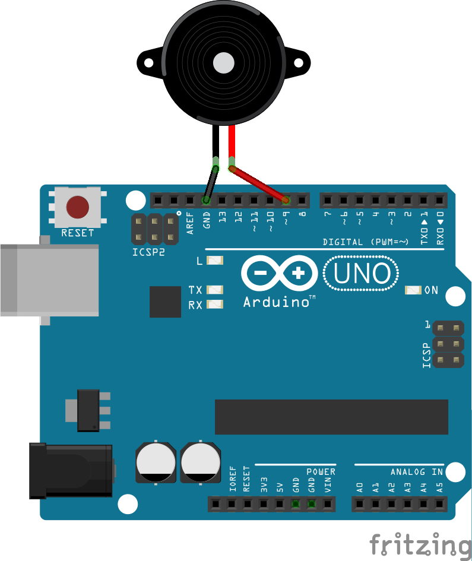

# Make a song

This tutorial connects a piezo buzzer to the Arduino to make a sound. With some
code, you can create music.

## Hardware

- Arduino
- Piezo buzzer
- wires

## Physical Setup



## Introduction

The text below comes from the SparkFun Inventor's Kit.

```
SparkFun Inventor's Kit
Example sketch 11

BUZZER

  Use the buzzer to play a song!

  The buzzer in your Inventor's Kit is an electromechanical
  component you can use to make noise. Inside the buzzer is a
  coil of wire and a small magnet. When current flows through 
  the coil, it becomes magnetized and pulls towards the magnet,
  creating a tiny "click". When you do this thousands of times
  per second, you create tones.
  
  The Arduino has a built-in command called tone() which clicks
  the buzzer at a certain frequency. This sketch knows the
  frequencies of the common notes, allowing you to create songs.
  We're never going to let you down!

Hardware connections:

  The buzzer has two pins. One is positive and one is negative.
  The postitive pin is marked by a "+" symbol on both the top
  and bottom of the buzzer.
  
  Connect the positive pin to Arduino digital pin 9.
  (Note that this must be a PWM pin.)
  Connect the negative pin to GND.
  
  Tip: if the buzzer doesn't fit into the breadboard easily,
  try rotating it slightly to fit into diagonal holes.

This sketch was written by SparkFun Electronics,
with lots of help from the Arduino community.
(This sketch was originally developed by D. Cuartielles for K3)
This code is completely free for any use.
Visit http://learn.sparkfun.com/products/2 for SIK information.
Visit http://www.arduino.cc to learn about the Arduino.

Version 2.0 6/2012 MDG

This sketch uses the buzzer to play songs.
The Arduino's tone() command will play notes of a given frequency.
We'll provide a function that takes in note characters (a-g),
and returns the corresponding frequency from this table:

  note 	frequency
  c     262 Hz
  d     294 Hz
  e     330 Hz
  f     349 Hz
  g     392 Hz
  a     440 Hz
  b     494 Hz
  C     523 Hz

For more information, see http://arduino.cc/en/Tutorial/Tone
```

## Code
```c
const int buzzerPin = 9;

// We'll set up an array with the notes we want to play
// change these values to make different songs!

// Length must equal the total number of notes and spaces 

const int songLength = 31;

// Notes is an array of text characters corresponding to the notes
// in your song. A space represents a rest (no tone)

char notes[] = "eee eee egcde fff ffee eeggfdc " ; // a space represents a rest

// Beats is an array of values for each note and rest.
// A "1" represents a quarter-note, 2 a half-note, etc.
// Don't forget that the rests (spaces) need a length as well.

int beats[] = {2,2,3,1, 2,2,3,1, 2,2,3,1,4,4, 2,2,3,0, 1,2,2,2,0, 1,1,2,2,2,2,4,4};

// The tempo is how fast to play the song.
// To make the song play faster, decrease this value.

int tempo = 260;


void setup() 
{
  pinMode(buzzerPin, OUTPUT);
  pinMode(13, OUTPUT);

}


void loop() 
{
  int i, b, duration;

  
  for (i = 0; i < songLength; i++) // step through the song arrays
  {
    duration = beats[i] * tempo;  // length of note/rest in ms
    
    if (notes[i] == ' ')          // is this a rest? 
    {
      delay(duration);            // then pause for a moment
    }
    else                          // otherwise, play the note
    {
      tone(buzzerPin, frequency(notes[i]), duration);
      digitalWrite(13, HIGH);
      delay(duration);            // wait for tone to finish
    }
    digitalWrite(13, LOW);
    delay(tempo/10);              // brief pause between notes

  }
  
  // We only want to play the song once, so we'll pause forever:
  //while(true){}
  // If you'd like your song to play over and over,
  // remove the above statement
}


int frequency(char note) 
{
  // This function takes a note character (a-g), and returns the
  // corresponding frequency in Hz for the tone() function.
  
  int i;
  const int numNotes = 8;  // number of notes we're storing
  
  // The following arrays hold the note characters and their
  // corresponding frequencies. The last "C" note is uppercase
  // to separate it from the first lowercase "c". If you want to
  // add more notes, you'll need to use unique characters.

  // For the "char" (character) type, we put single characters
  // in single quotes.

  char names[] = { 'c', 'd', 'e', 'f', 'g', 'a', 'b', 'C' };
  int frequencies[] = {262, 294, 330, 349, 392, 440, 494, 523};
  
  // Now we'll search through the letters in the array, and if
  // we find it, we'll return the frequency for that note.
  
  for (i = 0; i < numNotes; i++)  // Step through the notes
  {
    if (names[i] == note)         // Is this the one?
    {
      return(frequencies[i]);     // Yes! Return the frequency
    }
  }
  return(0);  // We looked through everything and didn't find it,
              // but we still need to return a value, so return 0.
}

```
