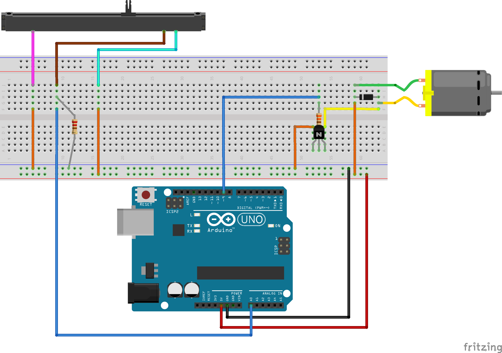

# Potentiometer and Motor

Control the speed of a motor with a potentiometer.

## Hardware

All components are from the SparkFun Inventor's Kit: https://www.sparkfun.com/products/12060

- Arduino Uno
- motor (https://www.sparkfun.com/products/11696)
- soft potentiometer (https://www.sparkfun.com/products/8680)
- transistor (https://www.sparkfun.com/products/13689)
- diode (https://www.sparkfun.com/products/8588)
- 330 Ohm resistor (https://www.sparkfun.com/products/11507)
- 10K Ohm resistor (https://www.sparkfun.com/products/11508)
- wires

## Physical setup




## Code

  ```java
  const int sensorPin = 0;  // Analog input pin
  const int motorPin = 9;   // Control motor from pin 9


  void setup() {
    pinMode(motorPin, OUTPUT); // Set up the motor pin to be an output:

    Serial.begin(9600);  // Set up the serial port:
  }

  void loop() {
    int speed;

    int sensorValue = analogRead(sensorPin);
    Serial.print("Sensor value:");
    Serial.print(sensorValue);

    if (sensorValue < 20)
    {
     speed = 0;
    }
    else
    {
     speed = constrain(map(sensorValue, 0, 1023, 50, 255), 50, 255);
    } 
    analogWrite(motorPin, speed);

    Serial.print(" Speed: ");
    Serial.println(speed);

  }
  ```
