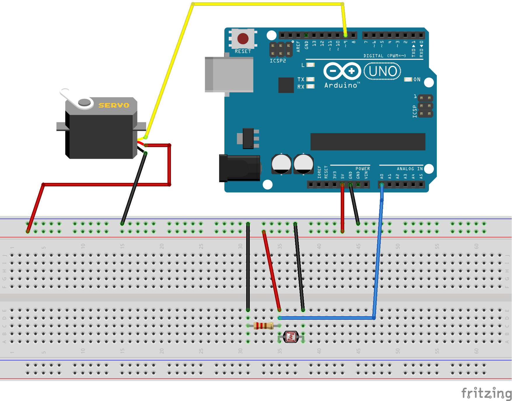

# Photoresistor + Servo

Scholars' Lab Arduino Tutorials

Example Sketch 05

Change the position of a servo motor based on the amount of light.

This sketch uses code from SparkFun Electronics sketches 
for example circuit 6 and 8, version 2.0 6/2012/ MDG
This code is completely free for any use.

Visit http://learn.sparkfun.com/products/2 for SIK information.

Visit http://www.arduino.cc to learn about the Arduino.


## Hardware

- Arduino
- Photo resistor: https://www.adafruit.com/products/161
- Servo motor: https://www.sparkfun.com/products/9065
- 10KΩ Resistor: https://www.adafruit.com/products/2784

## Physical Setup



## Code

```c++
/*
Scholars' Lab Arduino Tutorials
Example Sketch 05

PHOTO RESISTOR & SERVO

Change the position of a servo motor based on the amount of light.

This sketch uses code from SparkFun Electronics sketches 
for example circuit 6 and 8, version 2.0 6/2012/ MDG
This code is completely free for any use.
Visit http://learn.sparkfun.com/products/2 for SIK information.
Visit http://www.arduino.cc to learn about the Arduino.

Version 1.1/2016 AES
*/


// Include the Servo library
#include <Servo.h>

// Create constants for setting pins.
const int sensorPin = 0;
const int servoPin = 9;

// Set some contstants. Set the low at the highest value, it will auto adjust.
// Set the high at the lowest, it will also auto adjust.
int lightlevel, low = 1023, high = 0;

// Create servo control object
Servo servo;


void setup() {
  servo.attach(servoPin);
  Serial.begin(9600);
  
  // calibrate for the first five seconds after program runs
  while (millis() < 5000) {
    // record the maximum sensor value
    lightlevel = analogRead(sensorPin);
    if (lightlevel > high) {
      high = lightlevel;
    }
    // record the minimum sensor value
    if (lightlevel < low) {
      low = lightlevel;
    }
  }

}


void loop() {
  int position; // The position of the servo, from 0 to 180 degrees
  
  lightlevel = analogRead(sensorPin);
  Serial.print("Light Level: ");
  Serial.println(lightlevel);

  // Auto adjust the high and low.
  if ( lightlevel > high )
  {
    high = lightlevel;
  }
 
  if ( lightlevel < low )
  {
    low = lightlevel;
  }
  Serial.print("Highest = ");
  Serial.println(high);
  Serial.print("Lowest = ");
  Serial.println(low);
  
  // The map function allows us to map one range of numbers within another.
  // the light sensor returns a value from 100 to 400 (or some other range
  // depending on the amount of light available), but the servo needs a number 
  // between 0 and 180. The map function takes the light level (between 100
  // and 400) and converts it to a number between 0 and 180. We add or subract
  // 30 to make the difference between light and dark more dramatic.
  lightlevel = map(lightlevel, low+30, high-30, 0, 180);

  Serial.print("mapped light level = ");
  Serial.println(lightlevel);
  
  // The constrain function makes sure the value stays between 0 and 180 no
  // matter what.
  position = constrain(lightlevel, 0, 180);
 
  Serial.print("Servo Position: ");
  Serial.println(position);
  servo.write(position);  // Move the servo to the position
  
  Serial.println("\n");\
  //delay(2000);

  }
```

# Notes
- Seems to only work while plugged into a computer via USB cable. Does not work
  well with 4x AA batteries.
