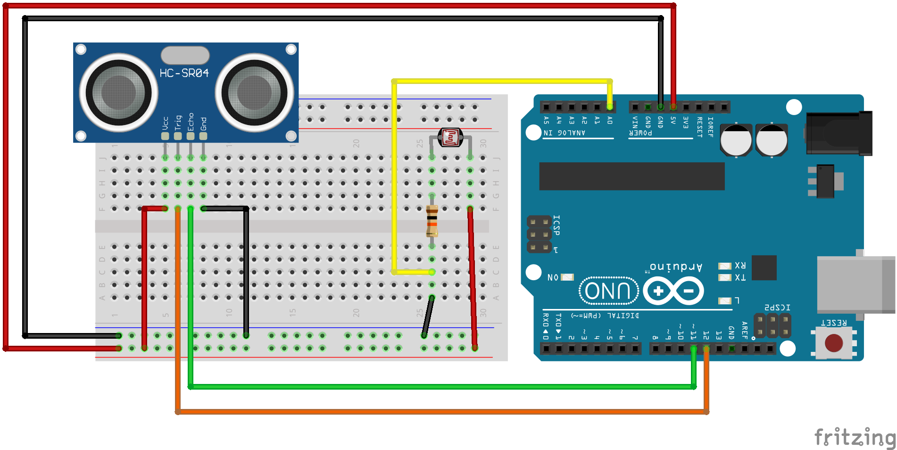

# Arduino to Processing - Sending Multiple Values


Let's say you have a circuit with multiple sensors and you want to send all of that data to processing.

Let's use a distance sensor and a photoresistor.


## Circuit Components

- 1x ultrasonic distance sensor
- 1x photoresistor
- 1x 10K Ohm resistor
- 1x Arduino
- 9x wires

## Circuit Diagram



## Arduino Code

```c++
const int trigPin = 12;
const int echoPin = 11;

float distance = 0;


void setup() {
  Serial.begin(9600);

  pinMode(trigPin, OUTPUT);
  pinMode(echoPin, INPUT);
}

void loop() {
  int speed;

  distance = getDistance();

  // Set up the Serial output data to look like this:
  // distance,light
  // example: 42.42,242
  Serial.print(distance);
  Serial.print(',');
  Serial.println( analogRead(0) );
}


float getDistance() {
  float echoTime;
  float calculatedDistance;

  // Make sure transmission pin is turned off first
  digitalWrite(trigPin, LOW);
  delayMicroseconds(2);

  //send out 10ms ultrasonic pulse
  digitalWrite(trigPin, HIGH);
  delayMicroseconds(10);
  digitalWrite(trigPin, LOW);

  echoTime = pulseIn(echoPin, HIGH);

  //half the bounce time multiplied by the speed of sound
  //calculatedDistance = echoTime / 148.0; // Uncomment for inches
  calculatedDistance = echoTime / 58.2; // Uncomment for centimeters

  return calculatedDistance;
}
```

We need to combine the sensor data into one "output", so we print the first sensor value, then a comma, then the second sensor value with the new line character to end the "output".

```c++
  Serial.print(distance);
  Serial.print(',');
  Serial.println( analogRead(0) );
```

The output will now look like this: `42.42,42`
Two values separated by a comma.

## Processing Code

```java
import processing.serial.*;

Serial serialObject;

// Instantiate here so it is accesible in multiple functions
String sensorValue;

void setup() {
  size(640, 360);
  serialObject = new Serial(this, Serial.list()[3], 9600);
  serialObject.bufferUntil(10); // 10 is ASCII code for line feed
}

void draw() {
  // Split the sensorValues into a String array
  String[] vals = splitTokens(sensorValue, ",");
  // Strings are easiest to convert to floats
  float distance = float(vals[0]);
  float light = float(vals[1]);

  background(0);
  stroke(255);
  strokeWeight(2);

  // map(<current value from sensor>, <lowest value from sensor>, <highest value from sensor>, <lowest color value>, <highest color value>)
  float mappedLight = map(light, 100, 800, 0, 255);
  fill(mappedLight, 100, 180);

  float mappedDistance = map(distance, 0, 40, 0, 300);
  mappedDistance = constrain(mappedDistance, 0, 300);
  ellipse(320, 180, mappedDistance, mappedDistance);
}

void serialEvent(Serial p) {
  sensorValue = p.readString();
}
```

The data coming from the serial port is the data type String. It comes in as two numbers separated by a comma.

```java
  void serialEvent(Serial p) {
    sensorValue = p.readString();
  }
```

We first need to split this data into two separate variables. The easiest way to do this is to use a built in function `splitTokens()` which converts each element separated by the given delimiter into an element of a String array.

```java
  String[] vals = splitTokens(sensorValue, ",");
```

We need the values to be an integer or a float, so we convert each array element into a float, and store it in a new float variable for ease of use.

```java
  float distance = float(vals[0]);
  float light = float(vals[1]);
```
