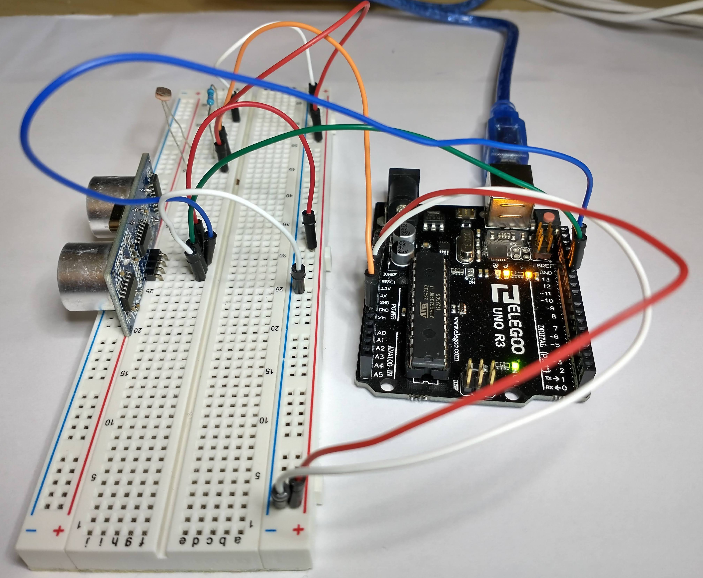

# Arduino to Processing - Sending Multiple Values


Let's say you have a circuit with multiple sensors and you want to send all of that data to processing.

Let's use a distance sensor and a photoresistor.



## Circuit Components

- 1x ultrasonic distance sensor
- 1x photoresistor
- 1x 10K Ohm resistor
- 1x Arduino
- 9x wires

## Circuit Diagram


## Arduino Code

```c++
const int trigPin = 12;
const int echoPin = 11;

float distance = 0;


void setup() {
  Serial.begin(9600);

  pinMode(trigPin, OUTPUT);
  pinMode(echoPin, INPUT);
}

void loop() {
  int speed;

  distance = getDistance();

  // Set up the Serial output data to look like this:
  // distance,light
  // example: 42.42,242
  Serial.print(distance);
  Serial.print(',');
  Serial.println( analogRead(0) );
}


float getDistance() {
  float echoTime;
  float calculatedDistance;

  // Make sure transmission pin is turned off first
  digitalWrite(trigPin, LOW);
  delayMicroseconds(2);

  //send out 10ms ultrasonic pulse
  digitalWrite(trigPin, HIGH);
  delayMicroseconds(10);
  digitalWrite(trigPin, LOW);

  echoTime = pulseIn(echoPin, HIGH);

  //half the bounce time multiplied by the speed of sound
  //calculatedDistance = echoTime / 148.0; // Uncomment for inches
  calculatedDistance = echoTime / 58.2; // Uncomment for centimeters

  return calculatedDistance;
}
```

We need to combine the sensor data into one "data packet", so we print the first sensor value, then a comma, then the second sensor value with the new line character to end the "data packet".

```c++
  Serial.print(distance);
  Serial.print(',');
  Serial.println( analogRead(0) );
```

The output will now look like this: `42.42,42`
Two values separated by a comma.

You can add more values to this pattern if you have more sensors. Three data points would be

```c++
  Serial.print(serialValues);
  Serial.print(',');
  Serial.print(distance);
  Serial.print(',');
  Serial.println( analogRead(0) );
```

This could send a data packet like this: `24,42.42,84`

You can even send text.

```c++
  Serial.print(serialValues);
  Serial.print(',');
  Serial.print(distance);
  Serial.print(',');
  Serial.print("dolphins");
  Serial.print(',');
  Serial.println( analogRead(0) );
```

This would send values like this: `28,61.16,dolphins,832`

## Processing Code

```java
import processing.serial.*;

Serial serialObject;

// Instantiate here so it is accessible in multiple functions
String serialValues;

void setup() {
  size(640, 360);
  serialObject = new Serial(this, Serial.list()[3], 9600);
  serialObject.bufferUntil(10); // 10 is ASCII code for line feed
}

void draw() {
  // Split the serialValuess into a String array
  String[] vals = splitTokens(serialValues, ",");
  // Strings are easiest to convert to floats
  float distance = float(vals[0]);
  float light = float(vals[1]);

  background(0);
  stroke(255);
  strokeWeight(2);

  // map(<current value from sensor>, <lowest value from sensor>, <highest value from sensor>, <lowest color value>, <highest color value>)
  float mappedLight = map(light, 350, 870, 0, 255);
  fill(mappedLight, 100, 180);

  float mappedDistance = map(distance, 0, 40, 10, 300);
  mappedDistance = constrain(mappedDistance, 10, 300);
  ellipse(320, 180, mappedDistance, mappedDistance);
}

void serialEvent(Serial p) {
  serialValues = p.readString();
}
```

The data coming from the serial port is the data type String. It comes in as two numbers separated by a comma. The Processing function `serialEvent()` takes care of listening to the serial port and putting the data in the serialValues variable.

```java
  void serialEvent(Serial p) {
    serialValues = p.readString();
  }
```

We first need to split this data into two separate variables. The easiest way to do this is to use a built in function `splitTokens()` which converts each element separated by the given delimiter into an item of a String array.

```java
  String[] vals = splitTokens(serialValues, ",");
```

We need the values to be an integer or a float, so we convert each array element into a float, and store it in a new float variable for ease of use.

```java
  float distance = float(vals[0]);
  float light = float(vals[1]);
```

If the Arduino code passed in four data points separated by commas, like this: `28,dolphins,42.04,579`

Then we could access each item after splitting like so (remember, array indexes start with 0):

- `vals[0]` has the value of `28`
- `vals[1]` has the value of `dolphins`
- `vals[2]` has the value of `42.04`
- `vals[3]` has the value of `579`

So we could turn these into variables like so:

```java
float temperature = float(vals[0]);
String animal = float(vals[1]);
float distance = float(vals[2]);
float light = float(vals[3]);
```

Next we map the light value to fit within the range 0 to 255. You should change the second and third elements in the map function (here it's the `350` and `870` values) based on the lowest and highest values from the photoresistor. It is easiest to see these values from Arduino's Serial Monitor. Cover the photoresistor to get the lowest value, and leave uncovered to get the highest.

```java
  float mappedLight = map(light, 350, 870, 0, 255);
  fill(mappedLight, 100, 180);
```

And then we map the distance value to fit within the range 10 to 300. This range is the size of the circle. You should change the second and third elements in the map function (here it's the `0` and `40` values) based on the lowest and highest values from the distance sensor. It is easiest to see these values from Arduino's Serial Monitor.

```java
  float mappedDistance = map(distance, 0, 40, 10, 300);
  mappedDistance = constrain(mappedDistance, 10, 300);
  ellipse(320, 180, mappedDistance, mappedDistance);
```

The line with the `constrain()` function restricts the values to be between 10 and 300. The map function allows for values greater than 300 or less than 10 if the value of `distance` is out of the range 0 to 40. The `constrain()` function constrains any value greater than 300 to be 300 and anything less than 10 to be 10.
