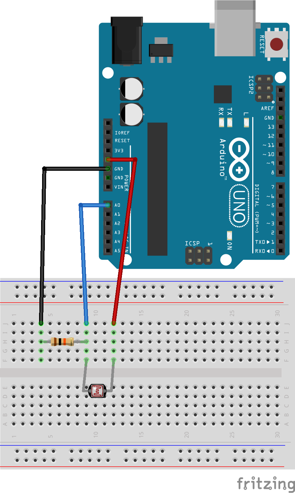
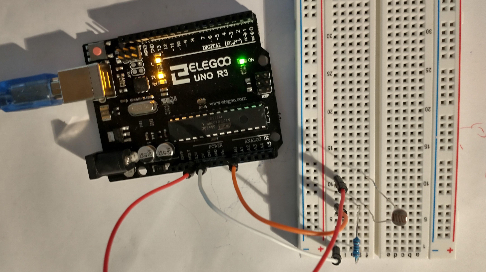
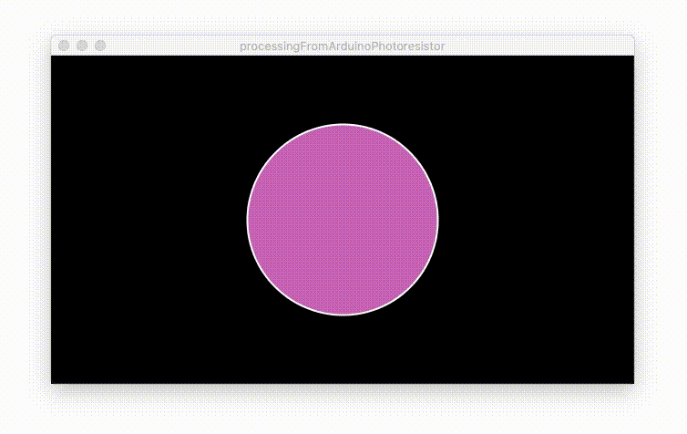

# Arduino to Processing with a Photoresistor


This is a bit more advanced tutorial than the [Arduino to Processing](arduino-to-processing.md) tutorial. This adds a circuit with a photoresistor to send "real world" data to Processing.

## Circuit Components

- 1x photoresistor
- 1x 10K Ohm resistor
- 1x Arduino

## Circuit Diagram



Connect one end of the photoresistor to 5V on the Arduino.
Connect the other end of the photoresistor to analog pin 0, AO, on the Arduino.
Connect the end of the photoresistor connected to pin A0 to one side of a 10K Ohm resistor.
Connect the other end of the 10K Ohm resistor to ground, GND, on the Arduino.



The 10K Ohm resistor acts as a voltage divider. Why is this needed?

> Analog to Digital Conversion

> The world we live in is analog, but the Arduino lives in a digital world. In order to have the Arduino sense analog signals, we must first pass them through an Analog to Digital Converter (or ADC). The six analog inputs (A0--A5) covered in the last circuit all use an ADC. These pins "sample" the analog signal and create a digital signal for the microcontroller to interpret. The "resolution" of this signal is based on the resolution of the ADC. In the case of the Arduino, that resolution is 10-bit. With a 10-bit ADC, we get 2 ^ 10 = 1024 possible values, which is why the analog signal varies between 0 and 1023.

> Voltage Divider Continued

> Since the Arduino can’t directly interpret resistance (rather, it reads voltage), we need to use a voltage divider to use our photoresistor, a part that doesn't output voltage. The resistance of the photoresistor changes as it gets darker or lighter. That changes the amount of voltage that is read on the analog pin, which "divides" the voltage, 5V in this case. That divided voltage is then read on the analog to digital converter.

> [https://learn.sparkfun.com/tutorials/sparkfun-inventors-kit-experiment-guide---v41/circuit-1c-photoresistor](https://learn.sparkfun.com/tutorials/sparkfun-inventors-kit-experiment-guide---v41/circuit-1c-photoresistor)

## Arduino code

[Arduino code](arduinoToProcessingPhotoresistor/arduinoToProcessingPhotoresistor.ino)

```c++
void setup() {
  Serial.begin(9600);
}

void loop() {
  Serial.println( analogRead(0) );
}
```

That's it! All that we need from the Arduino side of things is to start the Serial with a set baud rate, 9600 by default, in the `setup()` function with `Serial.begin(9600)`.

Then in the `loop()` function, we use `Serial.print()` to send the data read in from pin A0 with `analogRead(0)`

Very simple, just two lines of added code.

## Processing Code

[Processing Code](processingFromArduinoPhotoresistor/processingFromArduinoPhotoresistor.pde)

```java
import processing.serial.*;

Serial serialObject;
float sensorValue;

void setup() {
  size(640, 360);
  serialObject = new Serial(this, Serial.list()[3], 9600);
  serialObject.bufferUntil(10); // 10 is ASCII code for line feed
}

void draw() {
  background(0);

  // Set circle border color and size
  stroke(255);
  strokeWeight(2);

  // map(<current value from sensor>, <lowest value from sensor>, <highest value from sensor>, <lowest color value>, <highest color value>)
  float mappedValue = map(sensorValue, 70, 600, 0, 255);
  //print(mappedValue);
  fill(mappedValue, 100, 180);
  ellipse(320, 180, mappedValue, mappedValue);
}

void serialEvent(Serial p) {
  sensorValue = float(p.readString());
  //println(sensorValue);
}
```

The processing code is a bit more intense. Start by importing the serial libraries

`java import processing.serial.*;`

Then create a new Serial object and a new float variable

```java
Serial serialObject;
float sensorValue;
```

In the `setup()` function, we create the size of the display window,

`java size(640, 360);`

and connect the serial object to the serial port we need to use
`java serialObject = new Serial(this, Serial.list()[3], 9600);`

Remember, you can get the correct number to use in the `Serial.list()[#]` part by going to the Tools menu in the Arduino IDE, then the Port menu. Find the port for the Arduino, and count from the top of the list starting at zero. If you have a list of three ports, the first one is 0, the second is 1, and the third in the list is 2.

Finally, we'll call the `bufferUntil()` method to specify how to break up the data from the serial port. In this case we use the ASCII code for a line feed, which is the digit 10.

`java serialObject.bufferUntil(10); // 10 is ASCII code for line feed`

Next, in the `draw()` function we start creating a circle by setting the background color to black, `background(0)`, then the outline to white, `stroke(255)`, and the width of the outline to 2 pixels, `strokeWeight(2)`.

Now, we need to map the number from the sensor onto a different range of numbers. We'll use the number from the sensor to change the color and size of the circle. The sensor value comes in the range from 0 to 1023 (more likely 70 to 950), but the color value has to be between 0 and 255.

You can check the values of the sensor by running the Serial Monitor on the Arduino IDE. With the photoresistor completely uncovered, note the value that is returned. Round that number up by 50 to get the 'high value from sensor' number. Now cover up the sensor completely. Note the value. Round that number down by about 50 to get the 'lowest value from sensor' number.

The map function format is like this:

`map(<current value from sensor>, <lowest value from sensor>, <highest value from sensor>, <lowest color value>, <highest color value>)`

So the code to convert the sensor value into a number that can be used for color and size looks like this

`java float mappedValue = map(sensorValue, 70, 600, 0, 255);`

Now we can use that value in the `fill()` and `ellipse()` functions.

```java
  fill(mappedValue, 100, 180);
  ellipse(320, 180, mappedValue, mappedValue);
```

The final bit of code is a built in function to grab the data from the serial port

```java
void serialEvent(Serial p) {
  sensorValue = float(p.readString());
}
```

IMPORTANT! The data coming from the serial port is a String. In order to use it as a number we need to convert it to a `float` or `int`. This is why we wrap the `p.readString()` in the `float()` method. `serialEvent()`.

Now, if you run the Processing script and cover up the photoresistor, the circle will shrink and turn blue!


