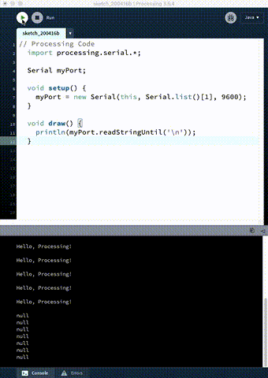

# Arduino to Processing


The basic concept is that we are sending information from the Arduino, through
the serial port on your computer (which the USB is connected to).

The Processing program can see that data coming through the serial port, and
use it in it's own code.

This allows you to use the sensors on the Arduino to affect your Processing code. For example:
- a photoresistor (Arduino) can change the playback speed of a video (Processing)
- a sound sensor (Arduino) can change the volume of audio playback (Processing)
- a temperature sensor (Arduino) can animate the petals on a drawing of a flower (Processing)

## Basic Arduino Code

[Arduino Code](arduinoToProcessing/arduinoToProcessing.ino)

This is super simple, and something you have most like already done at this point.

```c++
  // Arduino Code
  void setup() {
    Serial.begin(9600);
  }

  void loop() {
    Serial.println("Hello, Processing!");
  }
```

All you need to do on the Arduino side is send something to serial using the Serial method.

```c++ 
  Serial.begin(9600);
```
- The code above turns on the Serial connection from the Arduino to your computer. 

```c++ 
  Serial.println("Hello, Processing!");
``` 
- This code sends the string "Hello, Processing!" to the serial port.

## Basic Processing Code

[The Processing Code](processingFromArduino/processingFromArduino.pde)

Processing requires a couple more lines of code to read in the serial port data.

```java
  // Processing Code
  import processing.serial.*;

  Serial myPort;       

  void setup() {
    myPort = new Serial(this, Serial.list()[1], 9600);
    // printArray(Serial.list());
  }

  void draw() {
    println(myPort.readStringUntil('\n'));
  }
```

This is all that is needed to read in the code sent from the Arduino.

```java
import processing.serial.*;
```
- This line imports the Processing library to deal with the serial port. All of the methods needed for reading and writing to the serial port are included here.

```java
Serial myPort;
```
- This line creates an empty Serial object that we call `myPort`. Like a variable, we can name this anything we want.

```java
myPort = new Serial(this, Serial.list()[1], 9600);
```
- This line fills the empty object with some default data. 
  - `this` is a programming trick for an object to refer to itself. 
  - `Serial.list()[1]` calls the list method from the Serial library and
    selects the second value from the array. See the note about `Serial.list()`
    below.
  - 9600 is the baud rate. It must be set to the same frequency in Processing and
    Arduino.
 
Note: The result of `Serial.list()` is an array of the different serial ports on your
computer. `[1]` is the index from that list that we want to use. To find which
serial port the Arduino is connected to, you can run this sketch but uncomment
the `printArray(Serial.list());` line. The results are displayed in the Console
section of the Processing IDE. Or in the Arduino IDE, go to Tools->Port and
find the serial port assigned to the Arduino. Counting starts at zero. So if
there is only one port listed, change `Serial.list()[1]` to
`Serial.list()[0]`

```java
println(myPort.readStringUntil('\n'));
```
- This line will print the data from the serial port to the console in the Processing IDE. It should print out "Hello, Processing!" which was sent from Arduino!



This is super basic, and will do the job. See [Arduino to Processing with a
Photoresistor](arduino-to-processing-photoresistor.md) for adding more functionality.

