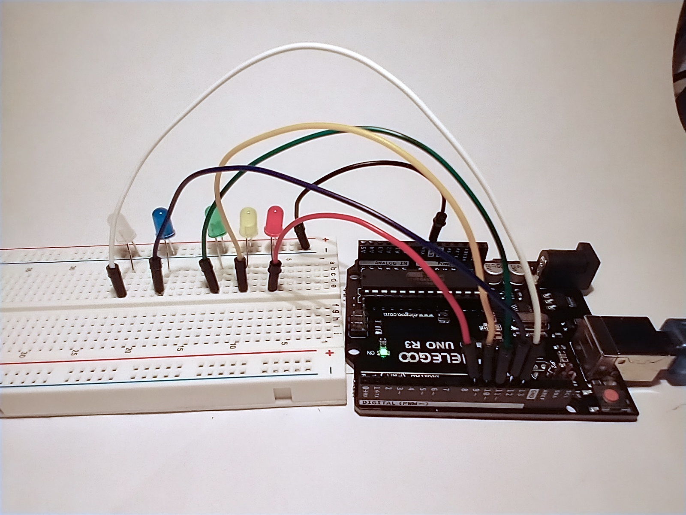
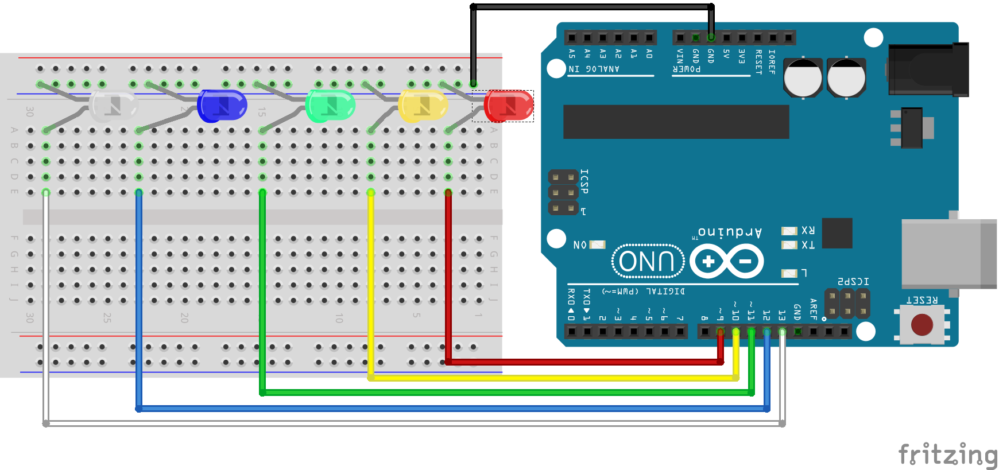

# Processing to Arduino with 5 LEDs


This tutorial shows how to use Processing to send data to Arduino, and how Arduino can check for the different values.

Basically, press a key on the keyboard while the Processing sketch is running to light up a specific color of LED connected to Arduino.



## Circuit Components

- Arduino
- 1 red LED
- 1 yellow LED
- 1 green LED
- 1 blue LED
- 1 white LED
- 6 wires

You can use any variety of LEDs. They don't need to be all different colors.

## Circuit Diagram



## Processing Code

[Processing Code](processingToArduinoFiveLEDs/processingToArduinoFiveLEDs.pde)

```java
import processing.serial.*;

Serial myPort;

void setup() {
  size(200, 200);
  myPort = new Serial(this, Serial.list()[3], 9600);
}

void draw(){}

void keyPressed() {
  if(key == 'r') {
    myPort.write('r');
  }
  if (key == 'y') {
    myPort.write('y');
  }
  if (key == 'g') {
    myPort.write('g');
  }
  if (key == 'b') {
    myPort.write('b');
  }
  if (key == 'w') {
    myPort.write('w');
  }
}
```

This simple code sets up Processing on the correct serial port (remember check
which port is correct on your computer by checking the Tools menu in the
Arduino IDE and start counting from 0, then change the number 3 in this line to
match your port `myPort = new Serial(this, Serial.list()[3], 9600);`)

We skip the `draw()` function and use Processing's built-in `keyPressed()`
function. This listens for a key being pressed on the keyboard. When a key is
pressed, we can check which key it is using the built-in variable `key` and
comparing it to the letter (or character) of the key. Note here that
capitalization matters; "r" is different than "R".

If the "r", "y", "g", "b", or "w" key is pressed, then the code will write that
character to the serial port.

## Arduino Code

[Arduino Code with 5 LEDs](arduinoFromProcessingFiveLEDs/arduinoFromProcessingFiveLEDs.ino)

```c++
int RED = 9;
int YEL = 10;
int GRE = 11;
int BLU = 12;
int WHI = 13;

void setup() {
  pinMode(RED, OUTPUT);
  pinMode(YEL, OUTPUT);
  pinMode(GRE, OUTPUT);
  pinMode(BLU, OUTPUT);
  pinMode(WHI, OUTPUT);
  Serial.begin(9600);
}

void loop() {
  char val = 'x';

  if (Serial.available()) {
    val = Serial.read();
  }


  if (val == 'r') {
    digitalWrite(RED, HIGH);
  } else {
    digitalWrite(RED, LOW);
  }


  if (val == 'y') {
    digitalWrite(YEL, HIGH);
  } else {
    digitalWrite(YEL, LOW);
  }


  if (val == 'g') {
    digitalWrite(GRE, HIGH);
  } else {
    digitalWrite(GRE, LOW);
  }


  if (val == 'b') {
    digitalWrite(BLU, HIGH);
  } else {
    digitalWrite(BLU, LOW);
  }


  if (val == 'w') {
    digitalWrite(WHI, HIGH);
  } else {
    digitalWrite(WHI, LOW);
  }

  delay(1000);
}
```

We start the Arduino code by creating variables to represent the pins where the LEDs are plugged into the Arduino.

```c++
int RED = 9;
int YEL = 10;
int GRE = 11;
int BLU = 12;
int WHI = 13;
```

The setup() function sets all of these pins to OUTPUT, and starts the connection to the serial port.

Inside the loop() function, we set a variable to the character "x". Then we listen on the serial port and store the data in the variable we just created. We set the value of the variable each time the loop is started so that the LEDs default to LOW or off. Only when the correct key is pressed will the LED turn HIGH or on.

The rest of the code in the loop() function does just that. Checks the value of val, and if it is the right character, it turns the LED on.
