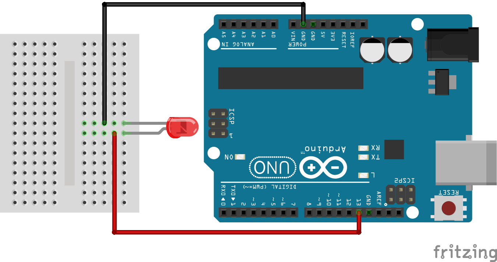
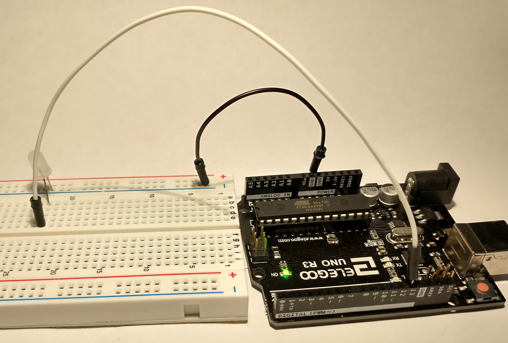

# Processing to Arduino


The basic concept is that we are sending information from Processing, through
the serial port on your computer (which the USB is connected to) to the
Arduino.

The Arduino can see that data coming through the serial port, and use it in
it's own code.

This allows you to control physical objects (motors, LEDs, speakers, etc) with a
graphical interface created in Processing. For example:
- clicking a button on the screen (Processing) can turn on/off an LED (Arduino)
- moving the mouse across the screen (Processing) can control the speed of a fan (Arduino)
- picking colored circles (Processing) can change the color of an RGB LED (Arduino)


## Basic Processing Code

[The basic Processing code](processingToArduino/processingToArduino.pde)

```java
import processing.serial.*;

Serial myPort;

void setup() {
  size(200, 200);
  myPort = new Serial(this, Serial.list()[3], 9600);
}

void draw() {
  if (mousePressed == true) {
    myPort.write('1');
    println("1");
  } else {
    myPort.write('0');
  }
}
```

This code is very simple, but is explained below.

```java
import processing.serial.*;
```
- First we import the Processing libraries for interacting with the serial port.

```java
Serial myPort;
```
- This creates a Serial object named `myPort`. Like a variable, this can be
  named anything you like.

```java
void setup() {
  size(200, 200);
  myPort = new Serial(this, Serial.list()[3], 9600);
}
```
- In the setup() function, we can create the size of the canvas, but this is
  optional.
- Then we fill the new Serial object with data.
  - `this` is a programming trick for an object to refer to itself. 
  - `Serial.list()[1]` calls the list method from the Serial library. 
  - 9600 is the baud rate. It must be set to the same frequency in Processing and
    Arduino.

```java
void draw() {
  if (mousePressed == true) {
    myPort.write('1');
    println("1");
  } else {
    myPort.write('0');
  }
}
```
- Inside the draw function we create an if..else statement to check if the
  mouse was pressed. If the mouse was pressed, then `myPort.write('1')` sends
  the string '1' to the serial port and also prints 1 on the console
  `println("1")`. Otherwise, send the string '0'.

That's it for Processing.

## Basic Arduino Code
This works best if you have an LED hooked up to the Arduino. The Arduino does
have a very small LED next to pin 13 that can be used to see if the code works,
but it's much more fun to build a circuit. :)

### Basic Cicuit


Connect the negative lead of an LED to GND on the Arduino. Then connect the
positive lead of the LED to pin 13 on the Arduino.



Real life circuit

### Basic Code

[The basic Arduino code](arduinoFromProcessing/arduinoFromProcessing.ino)
```c++
char val;
int LED = 13;

void setup() {
  pinMode(LED, OUTPUT);
  Serial.begin(9600);
}

void loop() {
  if (Serial.available()) {
    val = Serial.read();
  }

  if (val == '1') {
    digitalWrite(LED, HIGH);
  } else {
    digitalWrite(LED, LOW);
  }

  delay(10);
  }
```
This code will listen on the serial port and capture any data and store it in a
variable named `val`. If the value of that variable is the string '1', then it
will supply current to pin 13, otherwise it removes current from pin 13.

```c++
char val;
int LED = 13;
```
- These lines instantiate a variable named `val` of type character (a string in
  Arduino code). Then it creates an integer variable named `LED` and assigns
  the value 13. This number corresponds to the pin that the LED is physically
  plugged into on the Arduino board.

```c++
void setup() {
  pinMode(LED, OUTPUT);
  Serial.begin(9600);
}
```
- In the setup() function, we set pin 13 to be OUTPUT.
- And then begin the Serial capabilities on baud rate 9600. This number must
  match the rate specified in the Processing code.

```c++
  if (Serial.available()) {
    val = Serial.read();
  }
```
- This if condition tests if the Serial capabilities are available. The
  `Serial.available()` will return TRUE or FALSE. If it is true, then the next
  line of code will execute.
- If the condition is true, `Serial.read()` grabs the content that was sent
  over the Serial port and stores the value in the variable named `val` that we
  created at the to of the script.

```c++
  if (val == '1') {
    digitalWrite(LED, HIGH);
  } else {
    digitalWrite(LED, LOW);
  }
```
- This if...else statement checks the value of the `val` variable. If the value
  is a string of the number 1, then it executes the code to send current to pin
  13, `digitalWrite(LED, HIGH)`, otherwise it stops current to pin 13,
  `digitalWrite(LED, LOW)`.

```c++
delay(10);
```
- This just gives the script time to pause before executing again.

## Running the Sketches

First, send the code to the Arduino. Then run the Processing sketch. If you
click in the window generated by processing, the LED will light up!


