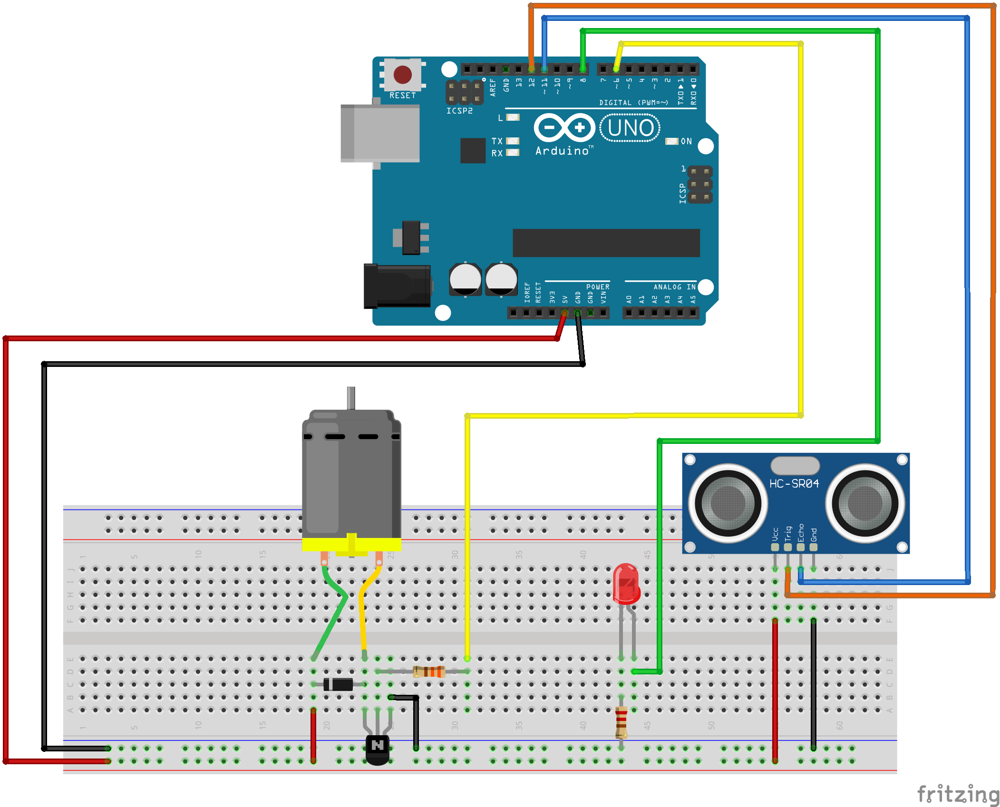

# Distance Sensor controlled Motor

This tutorial creates a circuit to control a motor with an ultrasonic distance sensor.

The greater the distance detected by the sensor, the faster the fan speed.

Motor and sensor code altered from 
- https://learn.sparkfun.com/tutorials/sik-experiment-guide-for-arduino---v33/experiment-12-driving-a-motor
- https://learn.sparkfun.com/tutorials/sparkfun-inventors-kit-experiment-guide---v40/circuit-3b-distance-sensor


## Components
- 1x Arduino Uno R3 + USB A-to-B Cable
- 1x Breadboard 12x Jumper Wires
- 1x DC Motor
- 1x 330Ω Resistor
- 1x NPN transistor
- 1x Diode 1N4148
- 1x HC-SR04 ultrasonic distance sensor
- 1x computer to connect the Arduino to with the Arduino IDE software installed (https://www.arduino.cc/en/software)

## Wiring Diagram


## Code

```c++

const int motorPin = 9;
const int trigPin = 11;
const int echoPin = 12;

float distance = 0;


void setup() {
  Serial.begin(9600);
  
  pinMode(motorPin, OUTPUT);
  pinMode(trigPin, OUTPUT);
  pinMode(echoPin, INPUT);
}

void loop() {
  int speed;
  
  distance = getDistance();

  Serial.print(distance);
  Serial.println(" cm");

  
  speed = map(distance, 0, 300, 100, 255);
  speed = constrain(speed, 100, 255);

  Serial.print("speed: ");
  Serial.println(speed);

  analogWrite(motorPin, speed);

  delay(1500);
}


float getDistance() {
  float echoTime;
  float calculatedDistance;

  //send out 10ms ultrasonic pulse
  digitalWrite(trigPin, LOW);
  delayMicroseconds(2);
  digitalWrite(trigPin, HIGH);
  delayMicroseconds(10);
  digitalWrite(trigPin, LOW);

  echoTime = pulseIn(echoPin, HIGH);

  //half the bounce time multiplied by the speed of sound
  calculatedDistance = (echoTime / 2) / 29.1;

  return calculatedDistance;
  }
```

