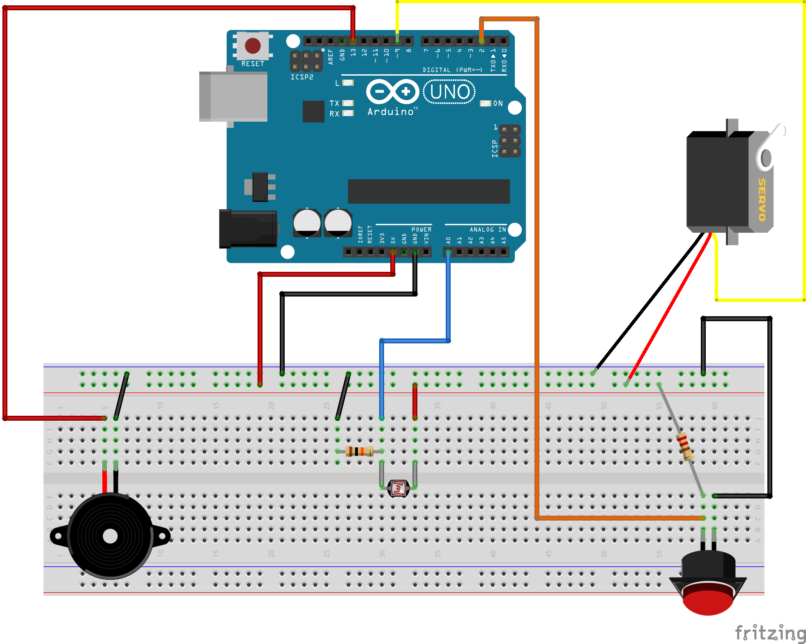

# Photoresistor => Buzzer && Button => Servo

This tutorial creates a circuit with two separate functions.
  - The photoresistor is used to play a tune on the buzzer based on a certain light level
  - When the button is pressed the servo motor moves 180 degrees. When released, it moves back to 0.


This sketch uses code from SparkFun SIK version 3.3, from experiments 5, 6, 8, and 11.
Visit https://learn.sparkfun.com/tutorials/sik-experiment-guide-for-arduino---v33/ for SIK information.
Visit http://www.arduino.cc to learn about the Arduino.
This code is completely free for any use.

## Components Needed:

- 1 - Arduino Uno R3 + USB A-to-B Cable
- 1 - Breadboard
- 12 - Jumper Wires
- 1 - Servo Motor
- 1 - 330Ω or 220Ω Resistor
- 1 - push button
- 1 - piezo buzzer
- 1 - photoresistor
- 1 - computer to connect the Arduino to with the Arduino IDE software installed (https://www.arduino.cc/en/software)

## Wiring Diagram



## Code

```c++
/**************************************************
   SERVO CODE
*/
// Include the Servo library
#include <Servo.h>

// Create constants for setting pins.
const int sensorPin = 0;
const int servoPin = 9;
// Create servo control object
Servo servo;
/**************************************************/


/**************************************************
   BUZZER CODE
*/
const int buzzerPin = 12;
const int songLength = 18;

char notes[songLength] =
{'c', 'd', 'f', 'd', 'a', ' ', 'a', 'g', ' ', 'c', 'd', 'f', 'd', 'g', ' ', 'g', 'f', ' '};

int beats[songLength] = {1, 1, 1, 1, 1, 1, 4, 4, 2, 1, 1, 1, 1, 1, 1, 4, 4, 2};

int tempo = 113;
/****************************************************/


/*****************************************************
   PHOTORESISTOR CODE
*/
// Set some contstants. Set the low at the highest value, it will auto adjust.
// Set the high at the lowest, it will also auto adjust.
int lightlevel, low = 1023, high = 0;
/* Change tripPoint value to increase or decrease the sensitivity. 
 * View the values produced by the photoresistor (Serial.println) 
 * to see what the high and low values will be. Set this about 100 
 * more than the low value.
 */
int tripPoint = 400;
/******************************************************/


/*****************************************************
   BUTTON CODE
*/
int buttonPin = 2;
int buttonState;
/*****************************************************/


void setup() {
  // set the servo pin
  servo.attach(servoPin);
  servo.write(0); // servo should be at 0 to start

  // set the buzzer pin
  pinMode(buzzerPin, OUTPUT);

  // set the button pin
  pinMode(buttonPin, INPUT);

  // Uncomment line below to allow for serial output - reading the sensor data
  Serial.begin(9600);

}


void loop() {
  /**************************************
     BUTTON AND SERVO CODE
  */
  buttonState = digitalRead(buttonPin);

  // if the button is pressed, move the servo to angle 180
  // if not, angle is 0
  if (buttonState == LOW) {
    servo.write(180);
  } else {
    servo.write(0);
  }
  /*************************************/


  /*********************************
     LIGHT AND BUZZER CODE
  */
  lightlevel = analogRead(sensorPin);

  Serial.println(lightlevel);

  if (lightlevel < tripPoint) {
    playBuzzer(); // this function created below
  }
  /********************************/

}


void playBuzzer()
{
  int i, duration; //

  for (i = 0; i < songLength; i++) // for loop is used to index through the arrays
  {
    duration = beats[i] * tempo;  // length of note/rest in ms

    if (notes[i] == ' ')          // is this a rest?
      delay(duration);            // then pause for a moment
    else                          // otherwise, play the note
    {
      tone(buzzerPin, frequency(notes[i]), duration);
      delay(duration);            // wait for tone to finish
    }
    delay(tempo / 10);            // brief pause between notes
  }

}

int frequency(char note)
{
  int i;
  const int numNotes = 8;  // number of notes we're storing
  char names[numNotes] = {
    'c', 'd', 'e', 'f', 'g', 'a', 'b', 'C'
  };
  int frequencies[numNotes] = {
    262, 294, 330, 349, 392, 440, 494, 523
  };

  // Now we'll search through the letters in the array, and if
  // we find it, we'll return the frequency for that note.

  for (i = 0; i < numNotes; i++)  // Step through the notes
  {
    if (names[i] == note)         // Is this the one?
    {
      return (frequencies[i]);    // Yes! Return the frequency and exit function.
    }
  }
  return (0); // We looked through everything and didn't find it,
  // but we still need to return a value, so return 0.
}

```
