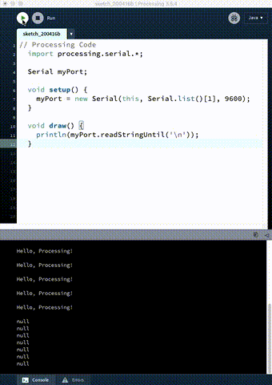

# Super Basic Arduino to Processing and Back again

Many of the tutorials out there have lots of unnecessary code and don't explain the basics of connecting the Arduino to Processing very well. This hopes to make it super simple.

## Basic Concept

The basic concept is that we are sending information from the Arduino, through the serial port on your computer (which the USB is connected to).

The Processing program can see that data coming through the serial port, and use it in it's own code.

This allows you to use the sensors on the Arduino to affect your Processing code. For example:
- a photoresistor (Arduino) can change the playback speed of a video (Processing)
- a sound sensor (Arduino) can change the volume of audio playback (Processing)
- a temperature sensor (Arduino) can animate the petals on a drawing of a flower (Processing)

The process can also be reversed. You can have processing send information to Arduino, too.
- clicking a button on the screen (Processing) can turn on/off an LED (Arduino)
- moving the mouse across the screen (Processing) can control the speed of a fan (Arduino)
- picking colored circles (Processing) can change the color of an RGB LED (Arduino)

## Basic Arduino Code

This is super simple, and something you have most like already done at this point.

```c++
  // Arduino Code
  void setup() {
    Serial.begin(9600);
  }

  void loop() {
    Serial.println("Hello, Processing!");
  }
```

All you need to do on the Arduino side is send something to serial using the Serial method.

```c++ 
  Serial.begin(9600);
```
turns on the Serial connection from the Arduino to your computer. 

```c++ 
  Serial.println("Hello, Processing!");
``` 
sends the string "Hello, Processing!" to the serial port.

## Basic Processing Code

Processing requires a couple more lines of code to read in the serial port data.

```java
  // Processing Code
  import processing.serial.*;

  Serial myPort;       

  void setup() {
    myPort = new Serial(this, Serial.list()[1], 9600);
    // printArray(Serial.list());
  }

  void draw() {
    println(myPort.readStringUntil('\n'));
  }
```

```java
import processing.serial.*;
```
imports the Processing library to deal with the serial port. All of the methods needed for reading and writing to the serial port are included here.

```java
Serial myPort;
```
This creates an empty Serial object that we call myPort. Like a variable, we can name this anything we want.

```java
myPort = new Serial(this, Serial.list()[1], 9600);
```
This fills the empty object with some default data. `this` is a programming trick for an object to refer to itself. `Serial.list()[1]` calls the list method from the Serial library. The result of `Serial.list()` is an array of the different serial ports on your computer. `[1]` is the index from that list that we want to use. To find which serial port the Arduino is connected to, you can run this sketch but uncomment the `printArray(Serial.list());`

```java
println(myPort.readStringUntil('\n'));
```
This line will print the data from the serial port to the console in the Processing IDE. It should print out "Hello, Processing!" which was sent from Arduino!



This is super basic, and will do the job. Later we'll see how to add more functionality.
