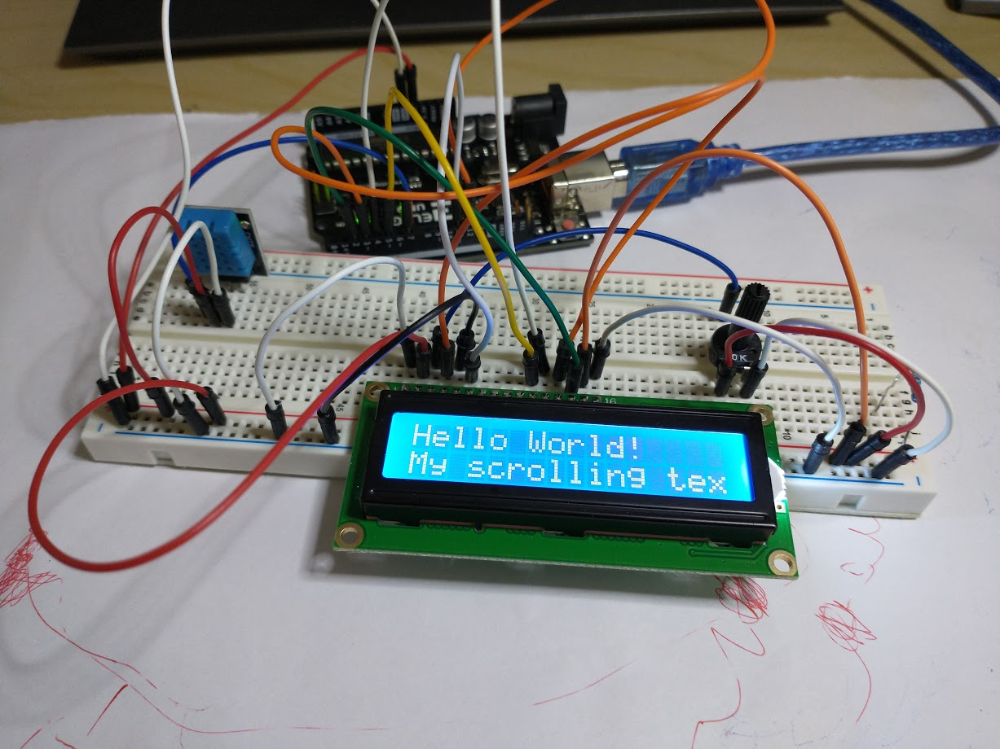
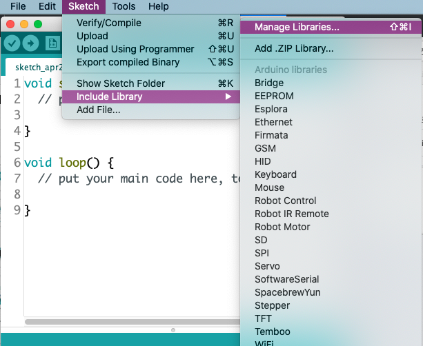
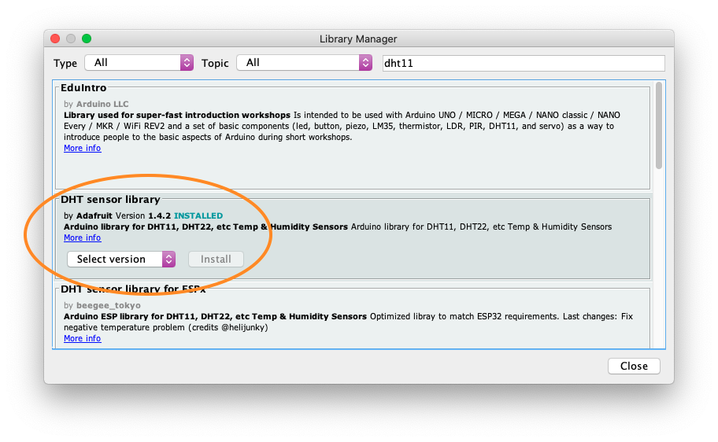
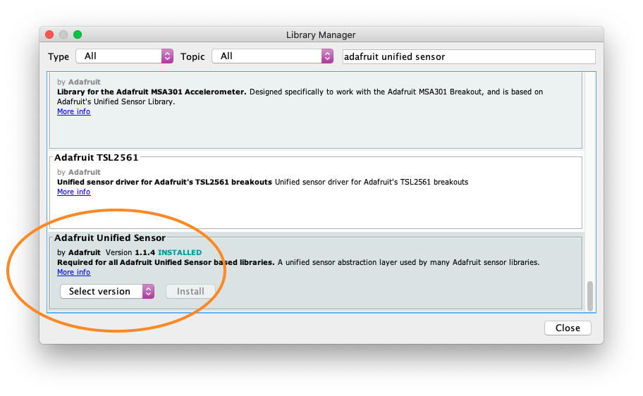
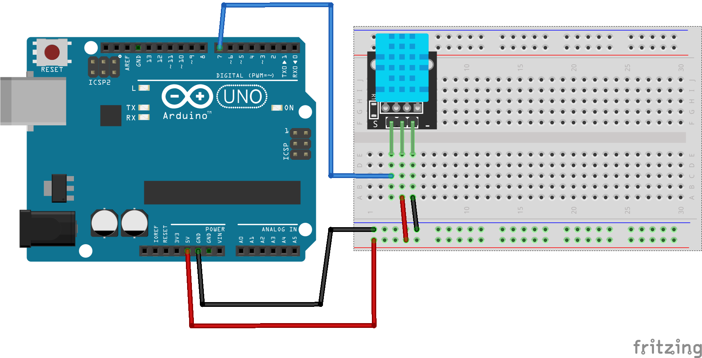
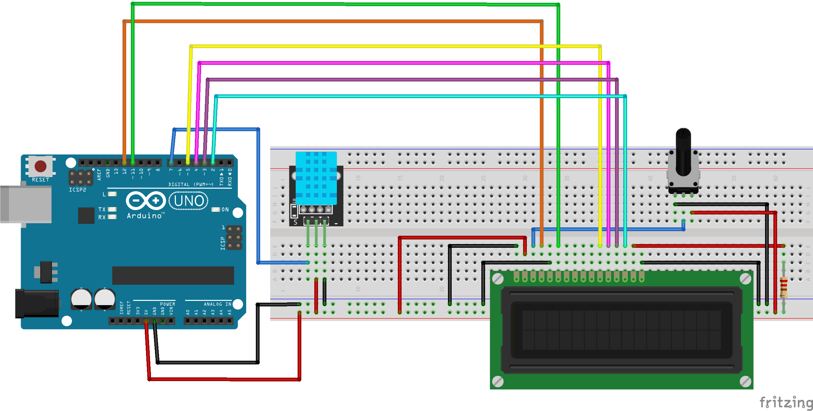

# Temperature Sensor & LCD 



This tutorial will help you put together a temperature and humidity sensor
(DHT11) and be able to view the data on the Liquid Crystal Display (LCD).


## Components Needed
- Arduino Uno
- DHT11 Temperature & Humidity Sensor
- LCD display
- 10K Potentiometer
- Breadboard
- wires

## Arduino Library
This circuit requires the DHT11 library and the Unified Sensor library from
Adafruit. To install the libraries, go to the Sketch menu, then Include
Library, then Manage Libraries.



Search for "dht11" and install the library created by Adafruit.



Then, search for "adafruit unified sensor" and scroll to the bottom of the
results and install the "Adafruit Unified Sensor" library.



### Documentation
- https://www.arduino.cc/reference/en/libraries/dht-sensor-library/
- https://www.arduino.cc/en/Reference/LiquidCrystal


## Wiring Diagrams

### DHT11 Sensor



### DHT11 & LCD



## Code
- DHT11 sensor

```c++
#include <DHT.h>
#define DHTTYPE DHT11

const int DHTPIN 7;

DHT dht(DHTPIN, DHTTYPE);

void setup() {
  Serial.begin(9600);

  dht.begin();
}

void loop() {
  delay(2000);

  float h = dht.readHumidity();
  float c = dht.readTemperature();
  float f = dht.readTemperature();

  Serial.print("Temperature: ");
  Serial.print(c);
  Serial.println("°C");

  Serial.print("Temperature: ");
  Serial.print(f);
  Serial.println("°F");
  
  Serial.print("Humidity: ");
  Serial.print(h);
  Serial.println("%");

  Serial.println();
}
```

- LCD
```c++
#include <LiquidCrystal.h>

LiquidCrystal lcd(12, 11, 5, 4, 3, 2);

void setup() {
  lcd.begin(16, 2);
  lcd.print("Hello World!");
}

void loop() {
  lcd.setCursor(0,1);
  lcd.print("My scrolling text...");
 
  lcd.scrollDisplayLeft();

  delay(1000);
  
}
```

- DHT11 and LCD
```c++
#include <LiquidCrystal.h>
LiquidCrystal lcd(12, 11, 5, 4, 3, 2);

#include <DHT.h>
#define DHTTYPE DHT11
const int DHT11_PIN = 7;
DHT dht(DHTPIN, DHTTYPE);

void setup() {
  lcd.begin(16, 2);
  dht.begin();
}

void loop() {
  delay(2000);

  lcd.setCursor(0,0);
  lcd.print("Temp: ");
  lcd.print(dht.readTemperature());
  lcd.print( (char)223); //Create the degree symbol
  lcd.print("C");

  lcd.setCursor(0,1);
  lcd.print("Humidity: ");
  lcd.print(dht.readHumidity());
  lcd.print("%");
}
```

# Resources 

## Components
- Arduino
  - https://www.amazon.com/Arduino-A000066-ARDUINO-UNO-R3/dp/B008GRTSV6
- DHT11 Temperature & Humidity Sensor
  - https://www.satistronics.com/shop/product/180806-ky-015-dht11-digital-temperature-and-relative-humidity-sensor-module-pcb-diy-starter-kit-9249
  - https://alltopnotch.co.uk/product/ky-015-dht11-temperature-and-relative-humidity-sensor-module-ntc-thermal-ky-015-arduino/
  - https://www.ev3dm.com/product/dht11-digital-temperature-and-humidity-sensor-new/
  - Note: Different versions of DHT11 sensors mounted on a PCB will have a
    different pin layout than the one used in this tutorial. The tutorial has
    pin 1 = Output, pin 2 = VCC, pin 3 = GND. These
    components have pin 1 = VCC, pin 2 = Output, pin 3 = GND
    - https://usa.banggood.com/KY-015-DHT11-Temperature-Humidity-Sensor-Module-p-916173.html
    - https://www.amazon.com/NOYITO-Digital-Temperature-Humidity-Arduino/dp/B07HX14M4K
    - https://www.adafruit.com/product/386
  - Some DHT11 sensors do not come mounted on an PCB. The PCB usually has a 10K
    Ohm pull up resistor connected to the signal/output pin. If you use a DHT11 without
    the PCB and built-in pull up resistor, then you will need to add the
    resistor to your circuit.
- LCD display
  - https://www.amazon.com/Arducam-Display-Controller-Character-Backlight/dp/B019D9TYMI
- 10K Potentiometer
  - https://www.amazon.com/uxcell-Carbon-Potentiometer-Variable-Resistors/dp/B07W78RFQF
- Breadboard
  - https://www.amazon.com/HiLetgo-Solderless-Breadboard-Circuit-Prototyping/dp/B00LSG5BJK
- wires
  - https://www.amazon.com/Elegoo-EL-CP-004-Multicolored-Breadboard-arduino/dp/B01EV70C78

- Or get a full kit
  - https://www.amazon.com/ELEGOO-Project-Tutorial-Controller-Projects/dp/B01D8KOZF4

## Other Tutorials
- https://www.electronicshub.org/dht11-humidity-sensor-arduino/
- https://www.circuitbasics.com/how-to-set-up-the-dht11-humidity-sensor-on-an-arduino/
- https://www.circuitbasics.com/how-to-set-up-an-lcd-display-on-an-arduino/
- https://learn.sparkfun.com/tutorials/sparkfun-inventors-kit-experiment-guide---v40/circuit-4a-lcd-hello-world
- http://omerk.github.io/lcdchargen/
