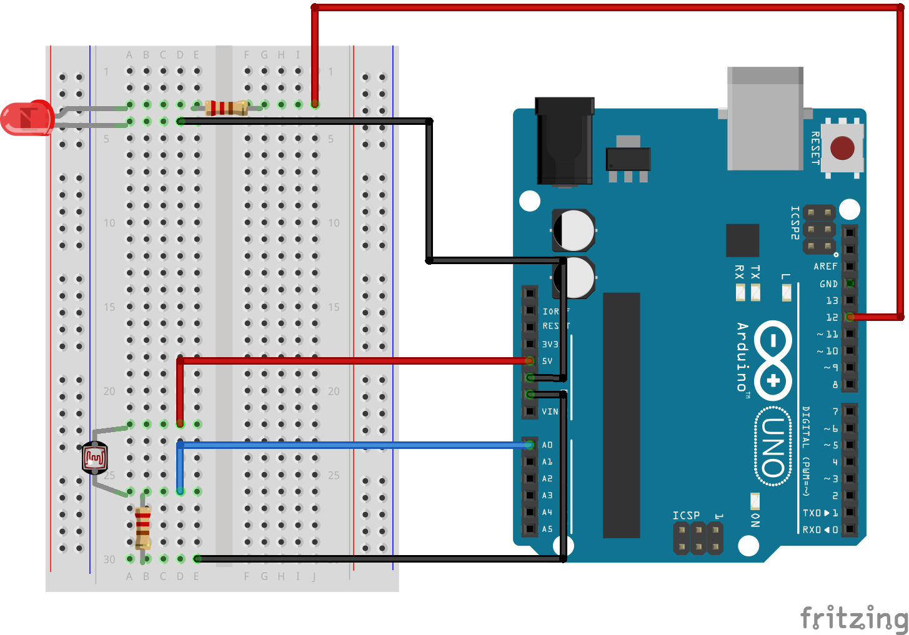

# Arduino Basics - The very basics of electricity and making a nightlight

This resource is meant to be used by teachers and instructors to create and run a workshop for other participants. There is no age range or limit intended with this resource.

This resource contains:

- A slide presentation in [Google Slides](https://tinyurl.com/arduino-basics-workshop) and [PDF](ArduinoWorkshop-BasicLED-Slides.pdf) format
- A [lesson plan](ArduinoWorkshop-BasicLED-LessonPlan.pdf), including instructor speaking script
  - Also available here: [https://scholarslab.lib.virginia.edu/makerspace/workshops/arduino/](https://scholarslab.lib.virginia.edu/makerspace/workshops/arduino/)
- Images and source files for circuits and [Arduino code](nightlight/nightlight.ino)

**Objectives of the workshop**

- In this workshop you will learn about and how to use some basic electronics components: resistor, LED, photoresistor, button.
- You will learn what an Arduino is and why they can be useful.
- You will learn how to build a circuit and program the Arduino.
- And, hopefully, you will come away with a feeling that you can create your own electronics projects that will improve your and other people’s environments.

## Components Needed

- Arduino kit, or Arduino with
- 1 USB cable
- 5 jumper wires, any color
- 1 LED, any color
- 1 10K Ohm resistor
- 1 100 Ohm to 330 Ohm resistor
- 1 photoresistor
- 1 breadboard
- Computer with Arduino IDE installed, or using the web based IDE
  - https://create.arduino.cc/editor
